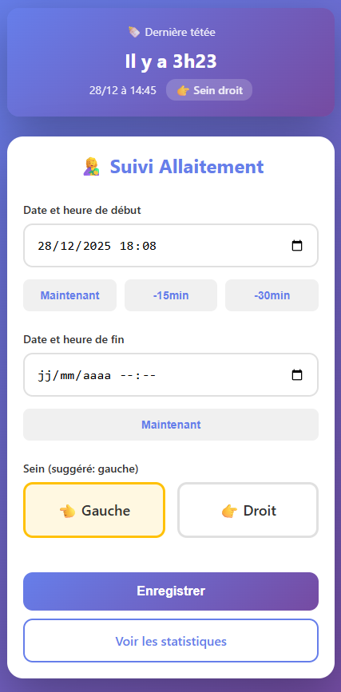
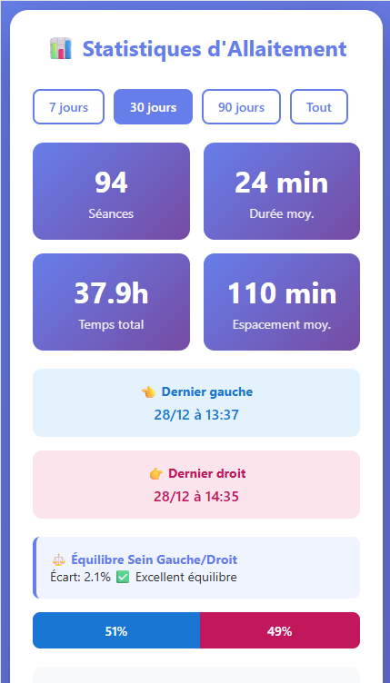
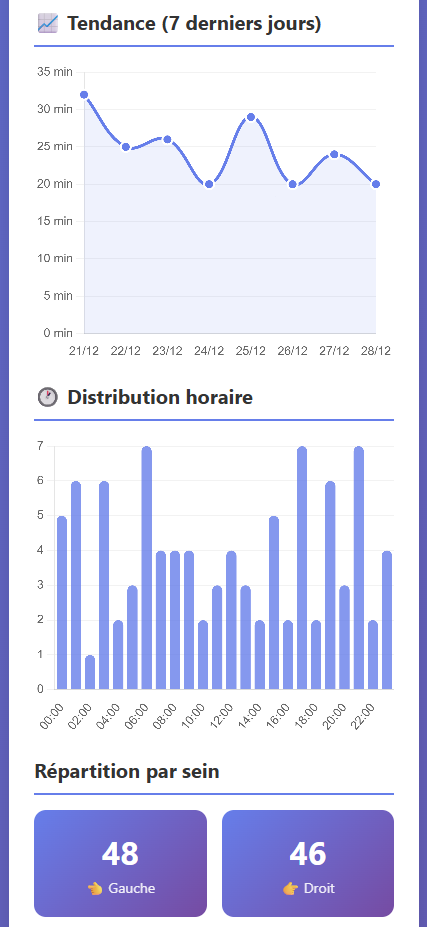
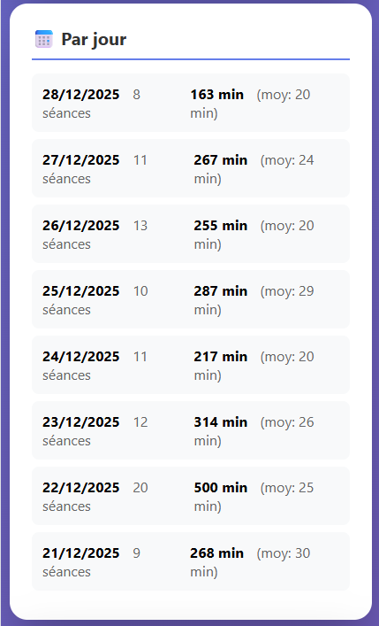
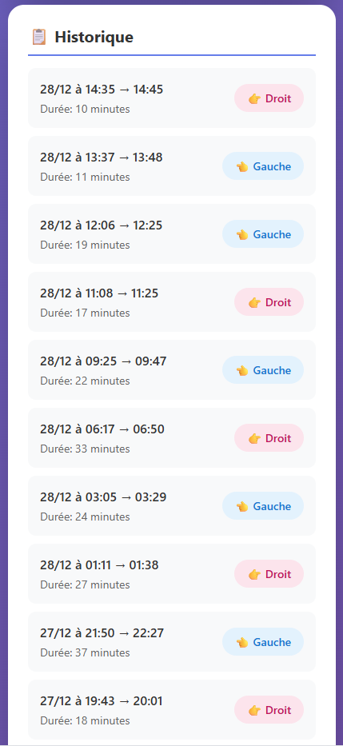

# 🤱 Suivi Allaitement

Une application web simple et élégante pour suivre vos séances d'allaitement au quotidien. Enregistrez facilement chaque tétée, visualisez vos statistiques et maintenez un équilibre optimal entre les deux seins.

## 📸 Captures d'écran

<div align="center">

### Page d'accueil - Enregistrement


### Statistiques détaillées


### Graphiques et tendances


### Historique des séances


### Vue mobile responsive


</div>

---

## ✨ Fonctionnalités principales

### 📝 Enregistrement des séances
- **Saisie rapide** : Boutons "Maintenant", "-15min", "-30min" pour un enregistrement instantané
- **Affichage du temps écoulé** : Visualisez le temps depuis la dernière tétée en temps réel
- **Suggestion intelligente** : Le système suggère automatiquement le sein opposé au dernier utilisé
- **Calcul de durée en direct** : Visualisez la durée calculée pendant la saisie
- **Détection des doublons** : Alerte si une séance similaire existe déjà (même sein dans les 5 dernières minutes)
- **Validation des durées** : Demande de confirmation pour les séances anormalement longues (> 45 min)

### 📊 Statistiques complètes
- **KPIs essentiels** : Nombre de séances, durée moyenne, temps total, espacement moyen
- **Équilibre gauche/droit** : Barre de progression visuelle et pourcentage d'écart
- **Distribution horaire** : Graphique en barres montrant les heures préférées de tétée
- **Tendance sur 7 jours** : Courbe d'évolution de la durée moyenne
- **Statistiques par jour** : Nombre de séances et durée totale quotidienne
- **Historique détaillé** : Liste des 20 dernières séances avec durée et sein utilisé

### 🔔 Alertes intelligentes
- **⏱️ Repos prolongé** : Alerte si plus de 5h sans tétée
- **⚖️ Déséquilibre détecté** : Notification si un sein est utilisé beaucoup plus que l'autre (> 10%)
- **📈 Tendance positive** : Félicitations si la durée moyenne augmente

### 📅 Filtres de période
- Visualisez vos données sur **7 jours**, **30 jours**, **90 jours** ou **toute la période**
- Analyse adaptée selon la période sélectionnée

### 🎨 Interface moderne
- **Design épuré** : Interface claire et intuitive avec dégradés colorés
- **Responsive** : Fonctionne parfaitement sur mobile, tablette et desktop
- **Animations fluides** : Transitions douces et interactions agréables
- **Code couleur** : Bleu pour sein gauche 👈, Rose pour sein droit 👉

---

## 🛠️ Technologies utilisées

- **Backend** : PHP 7.4+
- **Base de données** : MySQL avec PDO
- **Frontend** : HTML5, CSS3 (Flexbox, Grid)
- **JavaScript** : Vanilla JS (pas de framework)
- **Graphiques** : Chart.js 3.x
- **Architecture** : MVC léger avec séparation CSS/JS

---

## 📂 Structure du projet

```
allaitement/
├── config.php              # Configuration BDD
├── index.php               # Page d'enregistrement
├── stats.php               # Page de statistiques
├── css/
│   ├── style.css          # Styles communs
│   └── stats.css          # Styles des statistiques
├── js/
│   ├── form.js            # Logique du formulaire
│   └── charts.js          # Gestion des graphiques
├── includes/
│   ├── header.php         # En-tête HTML
│   └── footer.php         # Pied de page HTML
└── img/                   # Screenshots du README
```

---

## 🚀 Installation

### Prérequis
- PHP 7.4 ou supérieur
- MySQL 5.7 ou supérieur
- Serveur web (Apache, Nginx, ou équivalent)

### Étapes d'installation

1. **Cloner le projet**
```bash
git clone https://github.com/votre-username/suivi-allaitement.git
cd suivi-allaitement
```

2. **Créer la base de données**
```sql
CREATE DATABASE allaitement CHARACTER SET utf8mb4 COLLATE utf8mb4_unicode_ci;
USE allaitement;

CREATE TABLE seances (
    id INT AUTO_INCREMENT PRIMARY KEY,
    date_debut DATETIME NOT NULL,
    date_fin DATETIME NOT NULL,
    sein ENUM('gauche', 'droit') NOT NULL,
    duree_minutes INT GENERATED ALWAYS AS (TIMESTAMPDIFF(MINUTE, date_debut, date_fin)) STORED,
    created_at TIMESTAMP DEFAULT CURRENT_TIMESTAMP,
    INDEX idx_date_debut (date_debut),
    INDEX idx_sein (sein)
) ENGINE=InnoDB DEFAULT CHARSET=utf8mb4 COLLATE=utf8mb4_unicode_ci;
```

3. **Configurer la connexion**

Copier `config.example.php` en `config.inc.php` et modifier vos identifiants :
```php
define('DB_HOST', 'localhost');
define('DB_NAME', 'allaitement');
define('DB_USER', 'votre_user');
define('DB_PASS', 'votre_password');
```

4. **Démarrer le serveur**
```bash
# Avec PHP built-in server
php -S localhost:8000

# Ou configurez votre serveur web (Apache/Nginx)
```

5. **Accéder à l'application**
```
http://localhost:8000
```

---

## 💡 Utilisation

### Enregistrer une séance
1. Cliquez sur "Maintenant" pour définir l'heure de début
2. Allaitez votre bébé
3. Cliquez sur "Maintenant" pour définir l'heure de fin
4. Sélectionnez le sein utilisé (le système suggère automatiquement le bon)
5. Cliquez sur "Enregistrer"

### Consulter les statistiques
- Cliquez sur "Voir les statistiques" depuis la page d'accueil
- Sélectionnez une période (7, 30, 90 jours ou tout)
- Explorez les graphiques et analyses

---

## 🎯 Cas d'usage

Cette application est idéale pour :
- ✅ **Suivre la régularité** des tétées de votre bébé
- ✅ **Maintenir l'équilibre** entre les deux seins
- ✅ **Détecter les tendances** dans les habitudes alimentaires
- ✅ **Partager les données** avec votre pédiatre ou sage-femme
- ✅ **Identifier les heures de pointe** pour mieux organiser votre journée

---

## 🔐 Sécurité

- Protection contre les injections SQL avec PDO et requêtes préparées
- Échappement des sorties avec `htmlspecialchars()`
- Validation des données côté serveur
- Pas de stockage de données sensibles

---

## 🤝 Contribution

Les contributions sont les bienvenues ! N'hésitez pas à :
- 🐛 Signaler des bugs
- 💡 Proposer de nouvelles fonctionnalités
- 🔧 Soumettre des pull requests

---

## 📝 License

Ce projet est sous licence MIT. Voir le fichier [LICENSE](LICENSE) pour plus de détails.

---

## 👥 Auteur

Développé avec ❤️ pour faciliter le quotidien des jeunes parents.

---

<div align="center">

**⭐ N'oubliez pas de mettre une étoile si ce projet vous aide ! ⭐**

</div>